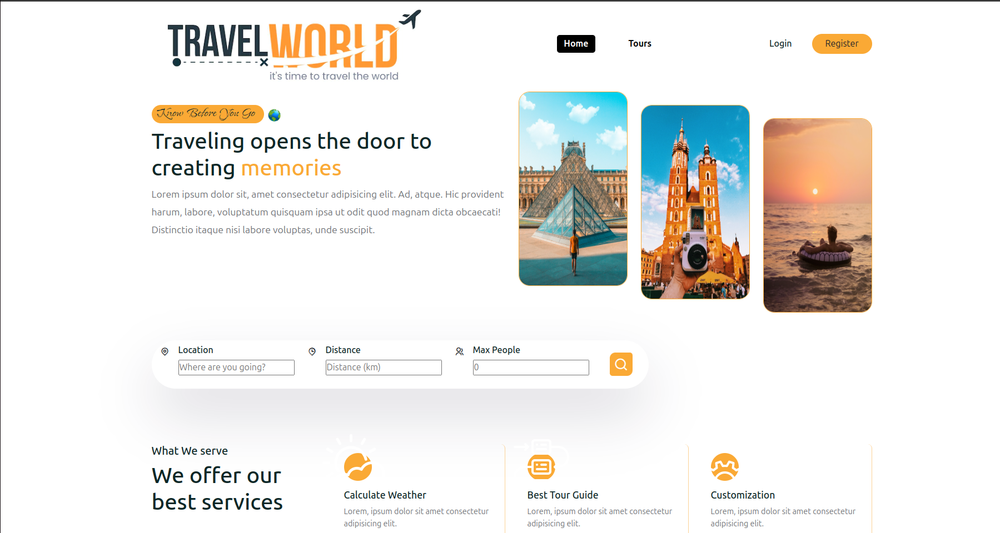
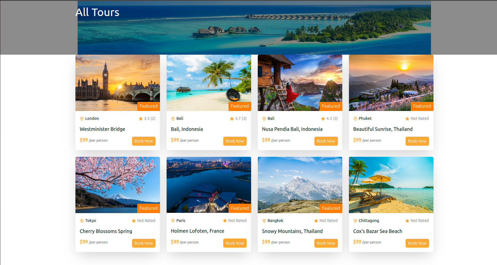
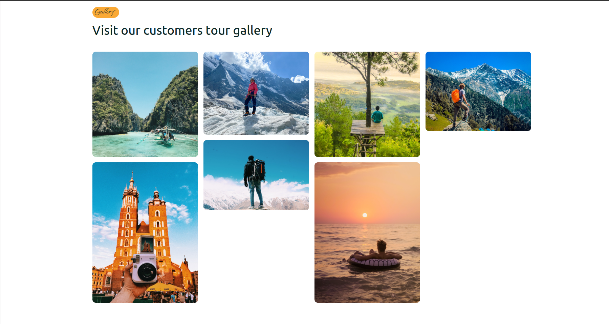
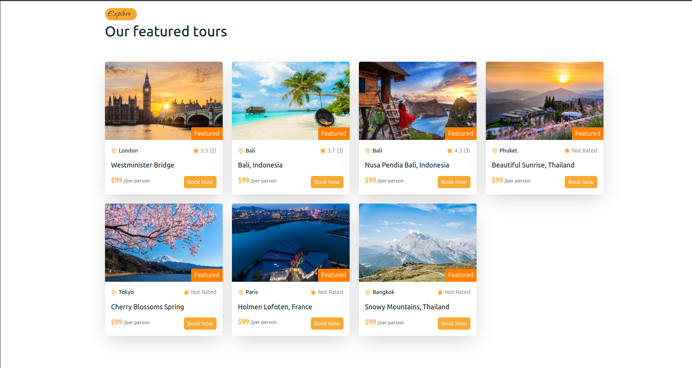
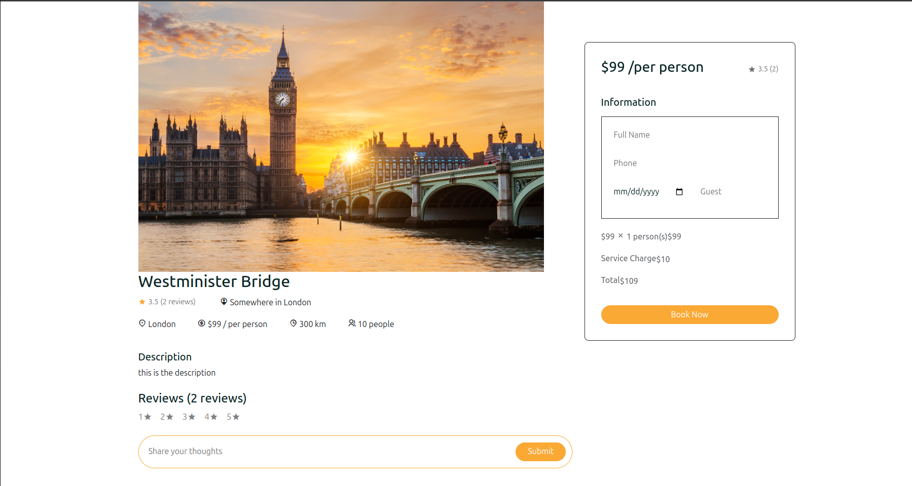
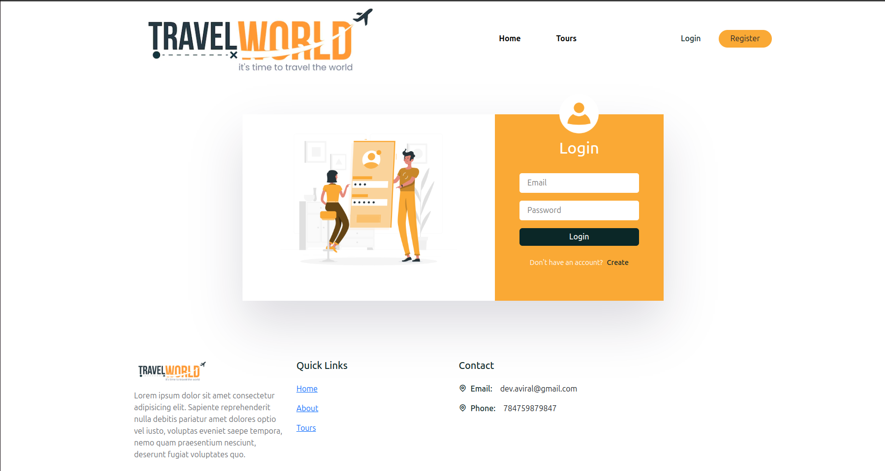
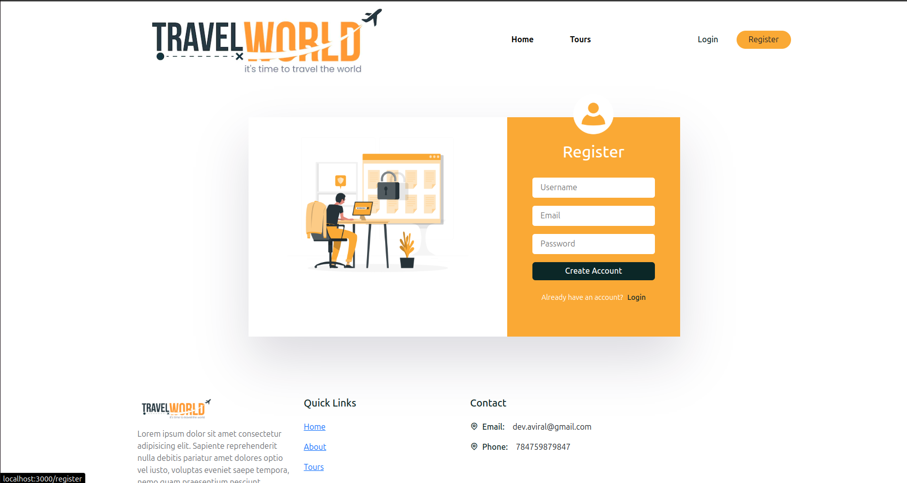

# Tours and Travel Booking Website

## 🎯 Features

**Login/Register:** Secure authentication for users to create an account and log in.

**Rate Trips:** Users can rate their trips and share their experiences.

**Leave Comments:** Add reviews or comments on trips you've taken.

**Book Trips:** Easily book your desired trips directly from the website.

**See Trip Costs:** Customizable trip cost calculation based on various factors like the number of people, destination, etc.

**Photo Gallery:** Explore beautiful photos from different trips in the gallery section.

## 🛠️ Tech Stack
- **Frontend:** React.js, HTML5, CSS3, Tailwind CSS
- **Backend:** Node.js, Express.js
- **Database:** MongoDB Atlas
- **APIs:** RESTful API design

## 📂 Project Structure

## ⚙️ Setup and Installation

Follow these steps to set up the project on your local machine:

# 1. Clone the Git Repository

Clone the project repository using the following command:

git clone <repository-link>

# 2. Install Dependencies

Navigate to the backend and frontend project folders and run the following command to install the required dependencies:

npm install

# 3. Run the Application

After installing the dependencies, start the development servers:

## For frontend:

npm start

## For backend:

npm run dev

# 4. Open in Your Browser

The application will be running at:

Frontend: http://localhost:3000

Backend: http://localhost:4000

Open these URLs in your browser to access the website.

# 5. Environment Variables

Create a .env file as shown in .env.example and configure the required settings.

## Future Enhancements

Creating a page where users can see all their booked tours.

Adding functionality to cancel booked tours.

Implementing a newsletter subscription feature to send users travel newsletters via email.

## 📝 Contribution Guidelines
To contribute:
1. Fork the repository.
2. Create a new branch for your feature/bug fix.
3. Commit your changes with meaningful commit messages.
4. Push to your fork and submit a pull request.

Feel free to contribute to the project by submitting issues and pull requests.

Happy Traveling! ✈️🌍

## 📬 Contact

For any queries, contact divyanshd@iitbhilai.ac.in

